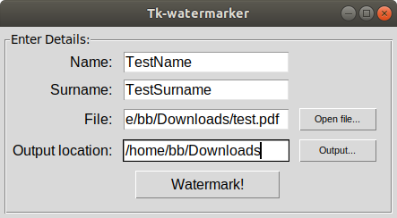

# Tk-watermarker

Cross-platform GUI tool for watermarking `pdf` files.

## Requirements:

- Python3
- Tkinter
- pipenv

## Installation:
`git clone https://github.com/barthol0/tk-watermarker.git`

`cd tk-watermarker`

`pipenv shell`

`pipenv install`

## How to use:

1. Type in name and surname.
2. Select `.pdf` file.
3. Select location of the finished `.pdf` file.
4. Watermark!

## How it works?
It creates a waterermark(name_surname_randomnumber) across your \*.pdf document starting from 3rd page.
Then `db_wmk.csv` is being created where `tk-watermarker.py` is located.

##### Watermark format:
`TestNmae_TestSurname_684150057`

##### CSV file structure:

|          |             |           |                            |
| -------- | :---------: | :-------: | :------------------------: |
| TestName | TestSurname | 684150057 | 2000-01-01 13:01:55.251006 |
