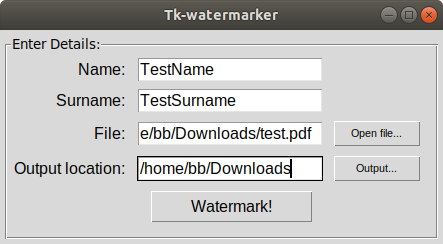

# Tk-watermarker



Tk-watermarker is a cross-platform graphical user interface (GUI) tool designed for adding watermarks to PDF files. This tool allows you to easily insert a personalized watermark onto your PDF documents.

## Features

-   **Cross-Platform Compatibility:** Works on Windows, macOS, and Linux systems.
-   **User-Friendly Interface:** Simple GUI to help users quickly select files and apply watermarks.
-   **Customizable Watermarks:** Create watermarks using your name, surname, and a unique random number.
-   **CSV Logging:** Automatically logs watermarking activity into a CSV file.

## Requirements

-   Python 3
-   Tkinter (usually included with Python installations)
-   pipenv (for managing dependencies)

## Installation and Running the Application

Follow these steps to install and run the Tk-watermarker application:

```bash
# Clone the repository
git clone https://github.com/barthol0/tk-watermarker.git

# Navigate to the project directory
cd tk-watermarker

# Create a virtual environment and activate it
pipenv shell

# Install the required dependencies
pipenv install

# Run the application
python tk-watermarker.py
```

## How to Use

1. **Enter Details:**

    - Type in your name and surname in the provided text fields.

2. **Select PDF File:**

    - Click the "Open file..." button to choose the PDF file you want to watermark.

3. **Select Output Location:**

    - Click the "Output..." button to select the directory where the watermarked PDF file will be saved.

4. **Apply Watermark:**
    - Click the "Watermark!" button to apply the watermark to your PDF. The watermarked file will be saved in the selected location.

## How It Works

-   The application generates a watermark in the format `name_surname_randomnumber` and applies it to each page of your PDF document, starting from the 3rd page.
-   A CSV file named `logs.csv` is created or updated in the directory where `tk-watermarker.py` is located. This file logs each watermarking activity with details such as the name, surname, random number, and timestamp.

### Watermark Format

Example watermark: `TestName_TestSurname_684150057`

### CSV File Structure

The CSV file logs the details of each watermarking operation in the following format:

| Name     |   Surname   | Random Number |      Timestamp      |
| -------- | :---------: | :-----------: | :-----------------: |
| TestName | TestSurname |   684150057   | 2000-01-01 13:01:55 |

## Troubleshooting

-   **Tkinter Not Found:** If you receive an error about Tkinter not being found, ensure it's installed on your system. You can usually install it via your package manager (e.g., `sudo apt-get install python3-tk` on Ubuntu).

## Contribution

If you would like to contribute to this project, please fork the repository and submit a pull request. For major changes, please open an issue first to discuss what you would like to change.

## License

This project is licensed under the MIT License. See the [LICENSE](LICENSE) file for more information.
